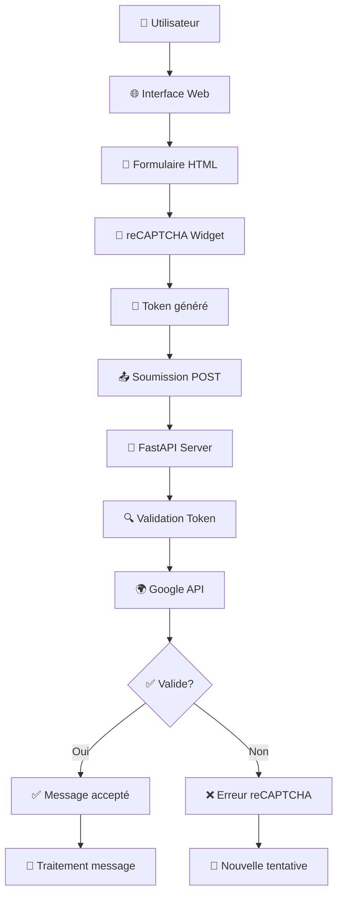

# 🛡️ Google reCAPTCHA v2 avec FastAPI

[](https://python.org)
[](https://fastapi.tiangolo.com)
[](LICENSE)

> **Projet d'intégration complète de Google reCAPTCHA v2 avec FastAPI**  
> Sécurisez vos formulaires web avec une implémentation robuste côté client et serveur.

## 📋 Table des matières

- [🎯 Aperçu](#-aperçu)
- [🏗️ Architecture](#️-architecture)
- [✨ Fonctionnalités](#-fonctionnalités)
- [🚀 Installation rapide](#-installation-rapide)
- [⚙️ Configuration](#️-configuration)
- [🔧 Utilisation](#-utilisation)
- [📁 Structure du projet](#-structure-du-projet)
- [🛠️ Technologies utilisées](#️-technologies-utilisées)
- [🔒 Sécurité](#-sécurité)
- [🐛 Dépannage](#-dépannage)
- [🤝 Contribution](#-contribution)

## 🎯 Aperçu

Ce projet démontre l'intégration complète de **Google reCAPTCHA v2** dans une application web moderne. Il combine une interface utilisateur élégante avec une validation serveur robuste pour protéger efficacement contre les bots et le spam.

### 🎥 Démonstration

```
┌─────────────────────────────────────────┐
│  📧 Formulaire de Contact Sécurisé      │
├─────────────────────────────────────────┤
│  Email: user@example.com                │
│  Message: [Votre message...]            │
│                                         │
│  ☑️ Je ne suis pas un robot            │
│                                         │
│  [Envoyer] ←── Validation reCAPTCHA     │
└─────────────────────────────────────────┘
```

## 🏗️ Architecture

### 📊 Diagramme de flux



### 🔄 Flux de données

```
┌─────────────┐    ┌─────────────┐    ┌─────────────┐
│   CLIENT    │    │   SERVEUR   │    │   GOOGLE    │
│             │    │             │    │             │
│ 1. Charge   │───▶│             │    │             │
│    la page  │    │ 2. Envoie   │    │             │
│             │◀───│    HTML +   │    │             │
│             │    │    site_key │    │             │
│             │    │             │    │             │
│ 3. Utilisateur    │             │    │             │
│    remplit le     │             │    │             │
│    formulaire     │             │    │             │
│             │    │             │    │             │
│ 4. reCAPTCHA│    │             │    │ 5. Génère   │
│    widget   │◀──────────────────────│    token    │
│             │    │             │    │             │
│ 6. Soumission│───▶│ 7. Validation│───▶│ 8. Vérifie │
│    POST +    │    │    côté     │    │    token    │
│    token     │    │    serveur  │    │             │
│             │    │             │    │             │
│ 10. Réponse │◀───│ 9. Traite   │◀───│ Résultat    │
│     finale  │    │    résultat │    │ validation  │
└─────────────┘    └─────────────┘    └─────────────┘
```

## ✨ Fonctionnalités

- ✅ **Intégration reCAPTCHA v2** complète
- ✅ **Validation côté serveur** sécurisée
- ✅ **Interface responsive** moderne
- ✅ **Gestion d'erreurs** robuste
- ✅ **Configuration flexible** via variables d'environnement
- ✅ **Logs de debug** détaillés
- ✅ **Support multi-domaines**
- ✅ **Clés de test** pour le développement

## 🚀 Installation rapide

### Prérequis

- **Python 3.8+**
- **pip** (gestionnaire de paquets Python)
- **Compte Google** pour reCAPTCHA

### 1️⃣ Cloner le projet

```bash
git clone https://github.com/Saidouchrif/google-recaptcha-python.git
cd google-recaptcha-python
```

### 2️⃣ Installer les dépendances

```bash
pip install -r requirements.txt
```

### 3️⃣ Configuration rapide

```bash
# Copier le fichier d'environnement
cp .env.example .env

# Éditer avec vos clés reCAPTCHA
nano .env
```

### 4️⃣ Lancer l'application

```bash
# Depuis le dossier racine
python server/main.py

# Ou avec uvicorn
uvicorn server.main:app --reload --host 127.0.0.1 --port 8000
```

🎉 **Votre application est maintenant accessible sur** `http://127.0.0.1:8000`

## ⚙️ Configuration

### 🔑 Obtenir les clés reCAPTCHA

1. **Allez sur** [Google reCAPTCHA Console](https://www.google.com/recaptcha/admin)
2. **Créez un nouveau site** avec les paramètres suivants :
   - **Type** : reCAPTCHA v2 "Je ne suis pas un robot"
   - **Domaines** : `localhost`, `127.0.0.1`, votre domaine de production
3. **Copiez** la Site Key et la Secret Key

### 📝 Fichier .env

```env
# Clés reCAPTCHA (remplacez par vos vraies clés)
RECAPTCHA_SITEKEY=6LeIxAcTAAAAAJcZVRqyHh71UMIEGNQ_MXjiZKhI
RECAPTCHA_SECRET=6LeIxAcTAAAAAGG-vFI1TnRWxMZNFuojJ4WifJWe

# URL de vérification Google (ne pas modifier)
GOOGLE_VERIFY_URL=https://www.google.com/recaptcha/api/siteverify
```

> 💡 **Les clés ci-dessus sont des clés de test Google qui fonctionnent sur tous les domaines**

## 🔧 Utilisation

### 🌐 Interface Web

1. **Accédez** à `http://127.0.0.1:8000`
2. **Remplissez** le formulaire de contact
3. **Cochez** la case reCAPTCHA
4. **Cliquez** sur "Envoyer"

### 🔍 API Endpoints

| Endpoint | Méthode | Description |
|----------|---------|-------------|
| `/` | GET | Page d'accueil avec formulaire |
| `/verify` | POST | Validation du formulaire + reCAPTCHA |
| `/index` | GET | Redirection vers `/` |

### 📊 Exemple de requête

```bash
curl -X POST "http://127.0.0.1:8000/verify" \
  -H "Content-Type: application/x-www-form-urlencoded" \
  -d "email=test@example.com&message=Hello&g-recaptcha-response=TOKEN"
```

## 📁 Structure du projet

```
google-recaptcha-python/
├── 📁 server/                    # Backend FastAPI
│   └── 📄 main.py               # Application principale
├── 📁 templates/                # Templates HTML
│   └── 📄 index.html           # Page d'accueil
├── 📁 static/                   # Fichiers statiques
│   └── 📄 style.css            # Styles CSS
├── 📄 .env                     # Variables d'environnement
├── 📄 requirements.txt         # Dépendances Python
├── 📄 README.md               # Documentation
└── 📄 .gitignore              # Fichiers ignorés par Git
```

### 📋 Description des fichiers

| Fichier/Dossier | Description |
|-----------------|-------------|
| `server/main.py` | 🐍 Serveur FastAPI avec routes et validation reCAPTCHA |
| `templates/index.html` | 🌐 Interface utilisateur avec formulaire sécurisé |
| `static/style.css` | 🎨 Styles CSS pour l'interface |
| `.env` | 🔐 Configuration des clés reCAPTCHA |
| `requirements.txt` | 📦 Liste des dépendances Python |

## 🛠️ Technologies utilisées

### Backend
- **[FastAPI](https://fastapi.tiangolo.com/)** `0.115.2` - Framework web moderne et rapide
- **[Uvicorn](https://www.uvicorn.org/)** `0.32.0` - Serveur ASGI haute performance
- **[HTTPX](https://www.python-httpx.org/)** `0.27.2` - Client HTTP asynchrone
- **[python-dotenv](https://pypi.org/project/python-dotenv/)** `1.0.1` - Gestion des variables d'environnement

### Frontend
- **HTML5** - Structure sémantique
- **CSS3** - Styles modernes et responsive
- **JavaScript** - Intégration reCAPTCHA côté client
- **[Google reCAPTCHA v2](https://developers.google.com/recaptcha/docs/display)** - Protection anti-bot

### Outils de développement
- **[Jinja2](https://jinja.palletsprojects.com/)** - Moteur de templates
- **[Pathlib](https://docs.python.org/3/library/pathlib.html)** - Gestion des chemins de fichiers

## 🔒 Sécurité

### ✅ Bonnes pratiques implémentées

- **Validation côté serveur** : Toutes les soumissions sont vérifiées par Google
- **Variables d'environnement** : Les clés sensibles ne sont jamais hardcodées
- **Timeout des requêtes** : Protection contre les requêtes qui traînent
- **Validation des données** : Vérification des champs obligatoires
- **Gestion d'erreurs** : Messages d'erreur informatifs sans exposition de données sensibles

### 🛡️ Recommandations de sécurité

- **HTTPS en production** : Utilisez toujours HTTPS pour les données sensibles
- **Rate limiting** : Implémentez une limitation du taux de requêtes
- **Logs de sécurité** : Surveillez les tentatives de contournement
- **Mise à jour régulière** : Maintenez les dépendances à jour

## 🐛 Dépannage

### ❌ Erreurs courantes

#### "Clé de site non valide"
```bash
# Vérifiez vos clés dans .env
cat .env

# Vérifiez les domaines autorisés dans Google Console
# Ajoutez localhost et 127.0.0.1
```

#### "reCAPTCHA manquant"
```bash
# Vérifiez que le JavaScript reCAPTCHA se charge
# Ouvrez les outils de développement du navigateur
# Onglet Console pour voir les erreurs
```

#### "Module non trouvé"
```bash
# Réinstallez les dépendances
pip install -r requirements.txt

# Vérifiez votre environnement Python
python --version
```

### 🔍 Debug

Activez les logs de debug en modifiant `main.py` :

```python
import logging
logging.basicConfig(level=logging.DEBUG)
```

### 📞 Support

- **Issues GitHub** : [Créer une issue](https://github.com/votre-username/google-recaptcha-python/issues)
- **Documentation Google** : [reCAPTCHA Docs](https://developers.google.com/recaptcha/docs/)
- **FastAPI Docs** : [Documentation officielle](https://fastapi.tiangolo.com/)

## 🤝 Contribution

Les contributions sont les bienvenues ! Voici comment contribuer :

### 🔄 Processus de contribution

1. **Fork** le projet
2. **Créez** une branche pour votre fonctionnalité (`git checkout -b feature/AmazingFeature`)
3. **Committez** vos changements (`git commit -m 'Add some AmazingFeature'`)
4. **Push** vers la branche (`git push origin feature/AmazingFeature`)
5. **Ouvrez** une Pull Request

### 📝 Guidelines

- **Code propre** : Suivez les conventions PEP 8
- **Tests** : Ajoutez des tests pour les nouvelles fonctionnalités
- **Documentation** : Mettez à jour la documentation si nécessaire
- **Commits** : Utilisez des messages de commit descriptifs

### 🏷️ Versioning

Ce projet utilise [SemVer](http://semver.org/) pour le versioning.

## 📄 Licence

Ce projet est sous licence MIT - voir le fichier [LICENSE](LICENSE) pour plus de détails.

## 👨‍💻 Auteur

**Saidouchrif** - [@Saidouchrif](https://github.com/Saidouchrif)

## 🙏 Remerciements

- **Google** pour l'API reCAPTCHA
- **FastAPI** pour le framework excellent
- **La communauté Python** pour les outils fantastiques

---

⭐ **N'hésitez pas à donner une étoile si ce projet vous a aidé !** ⭐
